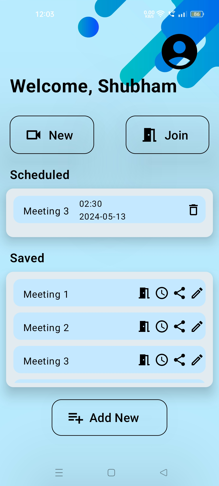

# SkySync: The Ultimate Video Conferencing Solution

## Overview
Welcome to SkySync, a next-generation video conferencing application designed to revolutionize the way you connect and collaborate remotely. Powered by the robust **ZegoCloud API**, SkySync offers a seamless and efficient video communication experience, whether you're catching up with friends or holding business meetings.

## Key Features
### Effortless Meeting Management
- **Easy Meeting Code Sharing**: Instantly share meeting codes for quick and convenient access.
- **Scheduled Meetings with Notifications**: Plan your meetings ahead and receive timely reminders.
- **Database Integration**: Save and retrieve meeting details effortlessly for future access.
- **Custom Profile Pictures**: Personalize your experience with custom avatars.

### Enhanced Security and Privacy
- **Privacy Protection**: Microphones and cameras are off by default to protect your privacy.
- **Secure Data Management**: Utilize Firebase for reliable and secure data storage.
- **Password Change with Email Authentication**: Change passwords securely through email verification.

### Intelligent User Experience
- **Room Lighting Conditions Warning**: Get notified about poor lighting conditions for optimal video quality.
- **Optimized Performance**: Enjoy a lightweight, high-performance user interface.
- **Minimalistic Design**: Experience a clean and modern design inspired by Google Material Theme.
- **Comprehensive Edge Case Handling**: Encounter clear and informative messages for a smoother experience.

## User Activities
### SignIn/SignUp
- **User Authentication**: Sign in or create an account using Google Firebase.
- **Password Reset**: Request a password reset if forgotten.

### Forget Password
- **Password Recovery**: Reset your password via email using Firebase.

### Home Screen
- **Meeting Management**: Start new meetings with auto-generated codes, join meetings, save meeting details, and schedule notifications.
- **Profile Editing**: Update your profile information and picture.
- **Google Firestore Integration**: Synchronize your meeting data across devices.

### Light Sensor Integration
- **Environment Check**: Monitor and get notified about the lighting conditions in your environment.

### Profile Screen
- **User Details**: View and edit your name and profile picture.
- **Password Change**: Update your account password.
- **Logout**: Sign out of your account securely.

### Notification Handling
- **Scheduling Notifications**: Set up and manage notifications for your scheduled meetings.
- **Custom Notifications**: Receive personalized notifications with custom messages and priorities.

### Conference Activity
- **User Customization**: Set custom usernames and avatars for meetings.
- **Default Configurations**: Microphone and camera settings are pre-configured for convenience.
- **Unique User Identification**: Each user gets a unique ID for video conferences.
- **ZegoCloud API**: Seamlessly integrate into the conference UI using ZegoCloud.

## Screenshots
### Home Screen
 

### SignIn/SignUp
  

### Features and Activities
       

## Contributing
We welcome contributions to enhance SkySync! Please fork the repository and create a pull request with your changes.

## License
This project is licensed under the MIT License - see the [LICENSE](LICENSE) file for details.

## Contact
If you have any questions or suggestions, feel free to reach out to me:
- Shubham Sharma: [shubham21099@iiitd.ac.in](mailto:shubham21099@iiitd.ac.in)
